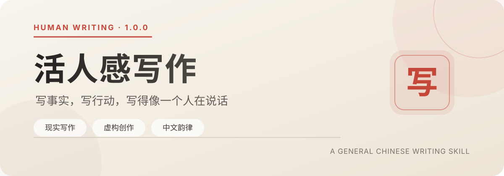

<p align="center">
  
</p>

<p align="center">
  <a href="README.md">繁體中文</a> ·
  <a href="README.en.md"><strong>English</strong></a>
</p>

<p align="center">
  <a href="https://github.com/SanHsien/human-writing/actions/workflows/ci.yml"></a>
  <a href="https://github.com/KKKKhazix/human-writing/releases/tag/v1.1.0"></a>
  <a href="./LICENSE"></a>
  <a href="https://github.com/KKKKhazix/human-writing/releases/latest"></a>
</p>

<p align="center">
  <a href="#quick-install">Install</a> ·
  <a href="#what-it-does">Writing flow</a> ·
  <a href="#repository-layout">Layout</a> ·
  <a href="#development">Development</a> ·
  <a href="https://github.com/KKKKhazix/human-writing/issues">Product issues</a>
</p>

> **This is a Windows-first maintenance fork of [`KKKKhazix/human-writing`](https://github.com/KKKKhazix/human-writing).** It keeps the MIT License and full git history. Product behaviour follows upstream; this line adds Traditional Chinese docs, a Windows development gate, and commit-by-commit upstream review. See [`FORK.md`](FORK.md) and [`docs/UPSTREAM.md`](docs/UPSTREAM.md).

> AI-written Chinese often sounds fluent, yet you cannot tell who wrote it. Human Writing exists to fix that.

The skill makes model output read like a specific person talking: someone who knows some things, has a judgment, can digress for a sentence, and still find the way back. It covers Zhihu answers, WeChat / blog essays, forum posts, profiles, popular science, reviews, fiction, and spoken scripts.

## What it does

Before writing, it asks a harder question: do you actually have material?

For nonfiction, missing facts must be researched, asked about, or cut. Padding with circular explanation is not allowed. Fiction may invent people and plots, but every scene still needs a goal, an action, and a change.

After the material gate, it watches three things:

| Material | Movement | Chinese |
| :--- | :--- | :--- |
| Nonfiction verifies facts, numbers, quotes, and lived experience. Fiction checks character, action, and cause. | Every paragraph must add something new. Repeating a finished point does not count. | Plain speech first. Watch word order and pauses. Strip report-speak, model-speak, and reversal rhetoric. |

A finished draft still has to pass revision. The skill checks whether paragraphs are spinning in place, cuts repeated explanations, varies sentence length, and blocks overused colons, dashes, “not A but B” reversals, and common AI jargon. The checker only enforces rules that are already written down. It does not choose a style for you.

## Quick install

Send this to your agent:

```text
Install this skill: https://github.com/SanHsien/human-writing
```

The agent should find the `human-writing` folder and install it. The display name is 「活人感寫作」.

To install the original project instead, use [`KKKKhazix/human-writing`](https://github.com/KKKKhazix/human-writing).

<details>
<summary><strong>If the agent cannot install from a GitHub URL</strong></summary>

Download the upstream [release](https://github.com/KKKKhazix/human-writing/releases/latest), or copy the [`human-writing`](./human-writing) folder into your local skills directory. Keep the folder name `human-writing`.

```text
~/.agents/skills/human-writing/
```

</details>

Then:

```text
Use $human-writing to turn my material into a piece with human texture and Chinese rhythm.
```

## What 1.1.0 changed

1.0 banned strings: “not A but B”, colons, and a list of buzzwords. Models swapped the wording and kept the same move. “You thought… actually…”, “only later did I realize”, and “not A but B” are the same posture. Readers notice the posture, not the letters.

1.1 moves the fence from wording to action: it bans “set up a misunderstanding the reader never had, then overturn it”, regardless of costume. The checker now warns on reversal variants, isomorphic lists, lyrical metaphors, sentence-length coefficient of variation, and conjunction density. Ordinary Chinese such as 「不丟人」 and 「打法」 was taken off the false-positive list. There is also a 2,000-character distilled prompt for chat windows.

See [CHANGELOG.md](./CHANGELOG.md) for the full list.

## Repository layout

<details>
<summary><strong>Show the skill tree</strong></summary>

```text
human-writing/
├── SKILL.md
├── VERSION
├── LICENSE
├── agents/
│   └── openai.yaml
├── dist/
│   └── human-writing-lite.md
├── references/
│   ├── forum-prose.md
│   ├── reality.md
│   ├── fiction.md
│   ├── formats.md
│   └── revision.md
└── scripts/
    └── check_prose.py
```

| Path | Role |
| :--- | :--- |
| [`SKILL.md`](./human-writing/SKILL.md) | Entry point: material gate, fiction/nonfiction split, writing flow, delivery bans |
| [`forum-prose.md`](./human-writing/references/forum-prose.md) | Long-form internet prose |
| [`reality.md`](./human-writing/references/reality.md) | Fact boundaries for people, history, news, data, lived experience |
| [`fiction.md`](./human-writing/references/fiction.md) | Fiction, dialogue, invented scenes |
| [`formats.md`](./human-writing/references/formats.md) | Short posts, spoken scripts, talks, tutorials, reviews |
| [`revision.md`](./human-writing/references/revision.md) | Pass-by-pass revision checklist |
| [`check_prose.py`](./human-writing/scripts/check_prose.py) | Hard-rule checker for finished drafts |
| [`human-writing-lite.md`](./human-writing/dist/human-writing-lite.md) | Distilled prompt for chat windows |

</details>

The product files stay in upstream Simplified Chinese. This fork adds [`AGENTS.md`](AGENTS.md), [`FORK.md`](FORK.md), and [`docs/DEVELOPMENT.md`](docs/DEVELOPMENT.md).

## Development

Windows 11 + PowerShell is the primary development and acceptance environment.

```powershell
python -m venv .venv
.venv\Scripts\python -m pip install --upgrade pip
.venv\Scripts\python -m pip install -r requirements-dev.txt
pwsh -NoProfile -File tools\dev_check.ps1
```

Details: [`docs/DEVELOPMENT.md`](docs/DEVELOPMENT.md). Upstream sync: [`docs/UPSTREAM.md`](docs/UPSTREAM.md).

## Feedback

MIT licensed. Product rules and tools are inherited from the upstream author's MIT-licensed work; this fork does not bundle third-party articles, training corpora, or model weights.

For product rules, false positives, or model behaviour, report the issue to [upstream](https://github.com/KKKKhazix/human-writing/issues). For Windows maintenance, CI, or fork-documentation changes, open a pull request against this fork with reproducible context.

<p align="center">
  <sub>Human Writing · 1.1.0 · SanHsien maintenance fork</sub>
</p>
